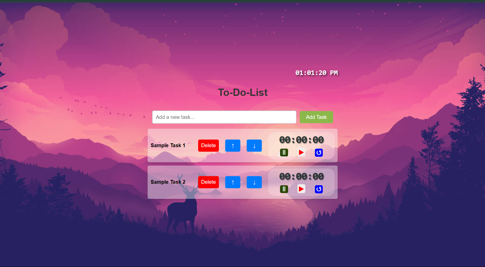

# 📝 To-Do Productivity App

A powerful and minimal **React.js** web app that combines a to-do list with a built-in **clock and timer** to help you stay focused, reduce distractions, and boost productivity.

---

## 🚀 Features

- ✅ **To-Do List** – Add, update, delete, and check off tasks
- ⏰ **Live Clock** – Always stay aware of the current time
- ⏳ **Countdown Timer** – Stay focused using time-blocking (like Pomodoro technique)
- 💡 **Distraction-Free UI** – Clean interface to help you focus on what matters

---

## 🛠️ Tech Stack

- **Frontend:** React.js
- **Styling:** CSS / Styled Components (choose based on your implementation)
- **State Management:** useState, useEffect hooks

---

## 📸 Screenshots

> Result:  
> 

---

## 📦 Installation

1. **Clone the repository:**
   ```bash
   git clone https://github.com/your-username/your-repo-name.git
   cd your-repo-name
